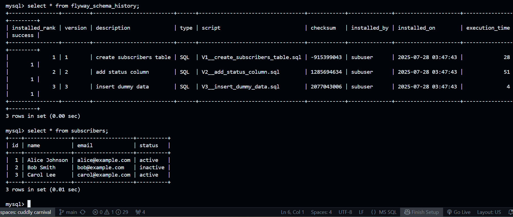

# PROG8850 – Assignment 4: Database Migration and Automation

## Author
**Name:** Twinkle Mishra  
**Student ID:** 8894858

---

## Part 1: Tool Comparison – Flyway vs Liquibase

### Overview

| Tool        | Description |
|-------------|-------------|
| **Flyway**   | A lightweight, open-source database migration tool using SQL or Java-based migrations. It manages version-controlled scripts to ensure database consistency. |
| **Liquibase** | A robust schema migration tool supporting XML, YAML, JSON, and SQL for defining database changes. It supports rollbacks and complex change tracking. |

### Feature Comparison

| Feature               | Flyway            | Liquibase        |
|------------------------|-------------------|------------------|
| **Ease of Use**        | Simple CLI usage  | More setup needed |
| **CI/CD Integration**  | Very straightforward | Supports Jenkins, GitHub Actions, etc. |
| **Supported DBs**      | MySQL, Postgres, etc. | Oracle, SQL Server, MongoDB, etc. |

### Integration Strategy

- Use **Flyway** for fast, version-controlled SQL-based schema migrations during development.
- Use **Liquibase** in enterprise settings where rollback, audit, and collaboration features are important.
- Both tools integrate well into GitHub Actions and can be triggered during CI/CD builds.

---

## Part 2: Flyway Automation, GitHub Actions, and Testing

### Project Structure

```
.
├── migrations/             # SQL migration scripts
│   ├── V1__create_subscribers_table.sql
│   ├── V2__add_status_column.sql
│   └── V3__insert_dummy_data.sql                
├── tests/                  # Python unit tests
├── flyway-init.conf        # Config for initial Flyway DB setup
├── flyway-update.conf      # Config for future incremental Flyway changes
├── mysql-adminer.yml       # Docker Compose for MySQL + Adminer
├── .github/workflows/      # GitHub Actions workflows
├── schema_changes.sql      # Raw SQL 
├── up.yml / down.yml       # Ansible playbooks for env setup/teardown
├── README.md
├── screenshots/            # Screenshots available
```

---

### Step-by-Step Instructions (Codespaces / Local)
## Prerequisites

- Docker & Docker Compose
- Python 3.12+
- Ansible
- ACT (Local GitHub Actions runner)

## Step-by-Step Instructions

### 1. Start MySQL + Adminer using Ansible

This sets up MySQL and Adminer locally using Docker Compose.

```bash
ansible-playbook up.yml
```

### 2. Run Flyway Migration

Run this from your project root after `up.yml` has completed and MySQL is up.

```bash
docker run --rm \
  --network a4-db-migration_default \
  -v "$PWD/migrations:/flyway/sql" \
  redgate/flyway \
  -user=subuser \
  -password=subpass \
  -url=jdbc:mysql://db:3306/subscriptions?allowPublicKeyRetrieval=true\&useSSL=false \
  migrate
```
### 3. Check Flyway Migration

```bash
docker run --rm \
  --network a4-db-migration_default \
  -v "$PWD/migrations:/flyway/sql" \
  redgate/flyway \
  -user=subuser \
  -password=subpass \
  -url=jdbc:mysql://db:3306/subscriptions?allowPublicKeyRetrieval=true\&useSSL=false \
  info
```
### 4. Run Unit Tests

Make sure DB is seeded (via Flyway) and container is running:

```bash
python3 tests/test_db.py
```

### 4. Run GitHub Actions Locally (ACT)

```bash
act push
```

### 5. Local MySQL Access

To manually connect to the MySQL container (running on port 3307), use:

```bash
mysql -u root -h 127.0.0.1 -P 3307 -p
```
- password: Secret5555

### 6. Tear Down

When done, clean up Docker containers with:

```bash
ansible-playbook down.yml
```

## Screenshots

All screenshots are stored in the `screenshots/` folder.

### CI Workflow Passing in ACT


### Flyway Migration Success


### Unit Tests Passing


### GitHub Actions Passing


### MySQL Table Data View


### Ansible `up.yml` Success


© 2025 Twinkle Mishra – 8894858
